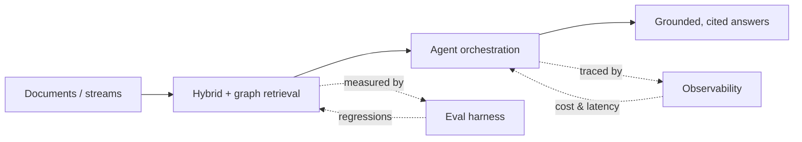

<h1 align="center">Aravind Pradeep</h1>

  <b>AI Engineer</b> — retrieval systems, agent pipelines, and the evaluation harnesses that keep them honest.

  
  
  

  
  
  

---

## Currently

**Building** — GraphRAG pipelines and multi-agent systems, with the evaluation and observability layers underneath them.

**Finishing** — M.Sc. Artificial Intelligence at BTU Cottbus-Senftenberg. Thesis: *Content-Aware ViT Optimization on Edge Devices* — cutting Vision Transformer compute while holding accuracy, with an explainability angle on what the model actually attends to.

**Looking for** — AI Engineer / ML Engineer roles in Germany or remote EU. Happy to relocate.

---

## What I actually build

Most of my work sits on one pipeline: **get the right context in, keep the model honest, prove it with numbers.**

| Layer | Repos |
|---|---|
| Retrieval | [`rag-eval-system`](https://github.com/axon011/rag-eval-system) · [`graphrag-agent`](https://github.com/axon011/graphrag-agent) · [`graphrag-studio`](https://github.com/axon011/graphrag-studio) |
| Agents | [`multi-agent-pipeline`](https://github.com/axon011/multi-agent-pipeline) · [`job-search-toolkit`](https://github.com/axon011/job-search-toolkit) |
| Training | [`llm-fine-tuning`](https://github.com/axon011/llm-fine-tuning) · [`Multilingual-News-NLP-Pipeline`](https://github.com/axon011/Multilingual-News-NLP-Pipeline) |
| Ops | [`llmops-dashboard`](https://github.com/axon011/llmops-dashboard) |

---

## Selected projects

Eight repos, one line each — open the ones you care about.

<b>graphrag-agent</b> — knowledge graphs + k-hop retrieval, so answers follow relationships instead of vector similarity

 

`Python` · `networkx` · `Docker`

Builds a typed, deduplicated knowledge graph from a corpus via LLM entity/relation extraction, then answers with **k-hop subgraph retrieval** — following explicit relationships rather than chunk-embedding similarity alone. Handles the multi-document, relationship-spanning questions flat RAG misses. LLM backend is pluggable across Claude, Codex and Gemini CLI providers, with a test suite over graph construction and retrieval.

<b>graphrag-studio</b> — the same engine as a product: upload docs, watch the graph build, chat with citations

 

`Next.js` · `TypeScript` · `React` · `FastAPI`

Upload documents and watch the knowledge graph build **incrementally in the UI** as they're processed, then chat over it with k-hop retrieval and answers cited back to source. Interactive force-graph visualization over a FastAPI backend wrapping the `graphrag-agent` package. Build progress streams to the front end — users see entities and relationships appear instead of waiting on a black-box batch job.

<b>rag-eval-system</b> — hybrid retrieval with an eval harness that alerts when quality regresses

 

`Qdrant` · `RAGAs` · `MLflow` · `BM25` · `FastAPI`

Dense embeddings + BM25 + Reciprocal Rank Fusion over a 50-topic corpus, reaching **0.94 hit@5 and 0.96 citation presence** on a 50-question evaluation set. RAGAs measures faithfulness, relevance and context recall; 50+ prompt experiments are tracked in MLflow with **regression alerts when retrieval quality drops below baseline**. Async embedding pre-computation and semantic caching keep eval runs fast enough to actually iterate on.

<b>multi-agent-pipeline</b> — Planner → Researcher → Writer, with Pydantic contracts between agents

 

`LangGraph` · `CrewAI` · `FastAPI` · `Docker`

A 3-agent pipeline built on LangGraph state machines with strict role boundaries. Inter-agent contracts are enforced by **Pydantic schema validation**, so every stage hands validated JSON downstream — handling multi-step reasoning a single LLM call can't. Produces 2,000+ word research reports with verifiable source citations. Async FastAPI, Docker, GitHub Actions CI/CD.

<b>llm-fine-tuning</b> — QLoRA on a 4 GB GPU: 100% JSON validity from 0.44% of the parameters

 

`QLoRA` · `PEFT` · `Qwen2-0.5B` · `PyTorch`

Fine-tuned Qwen2-0.5B (4-bit NF4, LoRA rank 16 / alpha 32 on attention projections) to extract structured JSON from job descriptions. **100% JSON validity and 70%+ entity-field accuracy** on a held-out set, trained in under 4 minutes on a 4 GB GPU. 2.16M adapter parameters — 0.44% of 496M total. Per-field evaluation exposed exactly where list-field F1 needed more data. Packaged as a reproducible pipeline: data prep → 4-bit training → JSON-schema validation of every output.

<b>llmops-dashboard</b> — self-hosted LLM observability, no external tracing SaaS

 

`FastAPI` · `React` · `PostgreSQL` · `Docker`

Every API call is traced to **your own PostgreSQL** with latency, token counts and per-model cost (GPT-4o, Claude, Gemini, DeepSeek) — plus a session explorer with prompt/response previews and a React + Recharts front end for token analytics and cost breakdowns. Multi-stage Docker build, GitHub Actions CI, 12 tests covering pricing, data parsing and API routes.

<b>Multilingual-News-NLP-Pipeline</b> — German news end to end: ASR → NER → classification → summarization

 

`Whisper` · `Transformers` · `NER` · `FastAPI`

Whisper ASR, cross-lingual NER, fine-tuned event classification, translation and summarization in one pipeline. **+13% F1 and 8.4× faster inference** — engineered to fit a single 4 GB GPU.

<b>job-search-toolkit</b> — scans boards + Telegram and gates JDs before you waste time tailoring

 

`Python` · `LLM gating`

Scans job boards and Telegram, filters roles against hard criteria, and gates job descriptions *before* any tailoring effort is spent. Dogfooded daily against my own search. Personal data stays gitignored.

---

## Numbers

| | |
|---|---|
| **0.94 / 0.96** | hit@5 and citation presence on the RAG evaluation harness |
| **50+** | prompt experiments tracked with automated regression alerts |
| **+13% F1 · 8.4×** | accuracy gain and inference speedup on the multilingual pipeline |
| **100%** | JSON validity from a fine-tune trained on 0.44% of the model's parameters |
| **48h → daily** | campaign reporting lag I removed at Perinet |
| **4 GB** | the GPU most of the above had to fit on |

---

## Experience

**AI Engineer (Working Student)** · Perinet GmbH · Cottbus · *Jul 2024 – May 2026*
Python and Go backend services wiring LLM workflows to live MQTT sensor streams, exposed as versioned async FastAPI endpoints; Docker/Kubernetes with GitHub Actions CI/CD. Led containerization for the AI Container umbrella project (PeriChat, MessageSense, PeriXplore) and owned the **model-benchmarking workstream** — retrieval speed, generation quality and trade-offs across model variants. Built a CEO-sponsored marketing-analytics pipeline pulling LinkedIn and GA4 data through MQTT into a dashboard, cutting reporting lag from ~48 hours to a daily refresh.

**Software Engineer Trainee** · Cognizant · India · *Oct 2021 – May 2022*
Mainframe applications (COBOL, JCL, DB2) in agile sprints across enterprise banking systems.

---

## Stack

  
  
  
  
  
  
  
  
  
  
  
  

**Agents & retrieval** — LangGraph · LangChain · CrewAI · RAG · GraphRAG · MCP · structured outputs (Pydantic) · tool use / function calling

**Evaluation & LLMOps** — RAGAs · MLflow · Langfuse · LLM-as-Judge · A/B prompt evaluation · regression detection · guardrails

**ML & NLP** — PyTorch · Hugging Face Transformers · QLoRA / PEFT · embeddings · NER · computer vision · explainable ML

**Data & infra** — Qdrant · ChromaDB · OpenSearch · PostgreSQL · REST / gRPC · MQTT · Azure · AWS (S3, Bedrock, EC2)

---

## Research

**M.Sc. Artificial Intelligence (Research Profile)** — BTU Cottbus-Senftenberg, thesis phase
*Content-Aware ViT Optimization on Edge Devices* — pruning, quantization and benchmarking to reduce Vision Transformer compute without giving up accuracy. Focus areas: machine learning, computer vision, explainable ML, data mining.

---

## Recently shipped

<!--AUTO:START-->
| Repo | What changed | Language | Last push |
|---|---|---|---|
| [`GraphRag`](https://github.com/axon011/GraphRag) | GraphRAG Resume Matcher An AI-powered talent acquisition system that us… | Python | 7d ago |
| [`graphrag-studio`](https://github.com/axon011/graphrag-studio) | Full-stack GraphRAG app: upload docs, watch a knowledge graph build, ch… | Python | 7d ago |
| [`graphrag-agent`](https://github.com/axon011/graphrag-agent) | Knowledge-graph construction + graph-augmented retrieval (GraphRAG). LL… | Python | 7d ago |
| [`german-tutor`](https://github.com/axon011/german-tutor) | — | TypeScript | 8d ago |
| [`windfarm-planner`](https://github.com/axon011/windfarm-planner) | Weather-constrained scheduler for a 12-turbine wind-farm build: determi… | Python | 9d ago |

Refreshed automatically · 31 Aug 2026
<!--AUTO:END-->

---

## Activity

  

<picture>
  <source media="(prefers-color-scheme: dark)" srcset="https://raw.githubusercontent.com/axon011/axon011/output/snake-dark.svg" />
  <source media="(prefers-color-scheme: light)" srcset="https://raw.githubusercontent.com/axon011/axon011/output/snake-light.svg" />
  
</picture>

---

  <b>Open to AI Engineer & ML Engineer roles — Germany or remote EU.</b> 
  <a href="mailto:aravindpradeep001@gmail.com">aravindpradeep001@gmail.com</a> ·
  <a href="https://aravindpradee.me">aravindpradee.me</a> ·
  <a href="https://linkedin.com/in/aravind-pradeepmadathinal">LinkedIn</a>

